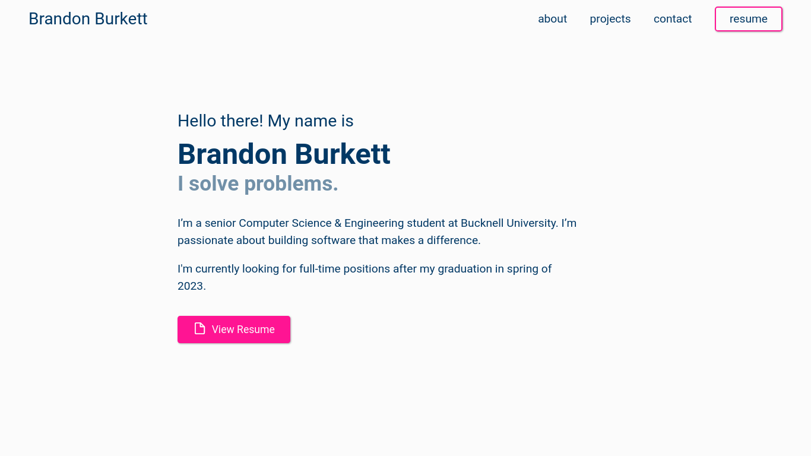

# brandondburkett.com

A portfolio website to showcase personal projects, experiences, and skills.

## Installation

1. Clone the repository
2. Install dependencies with `npm install`
3. Run the development server on http://localhost:3000 with `npm run dev`
4. Build the project with `npm run build`
5. Preview the production build with `npm run preview`

Checkout the [deployment documentation](https://v3.nuxtjs.org/guide/deploy/presets) for more information.

## Contributing

Pull requests are welcome. For major changes, please open an issue first to discuss what you would like to change.

## Inspiration

- [Brittany Chiang](https://brittanychiang.com/)
